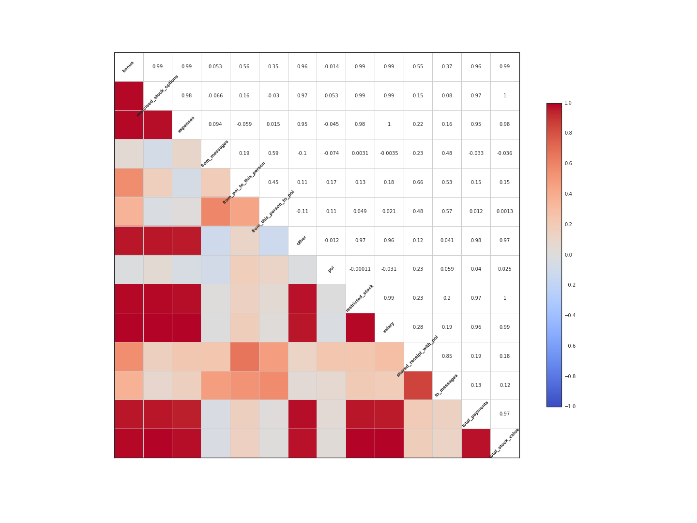

# Identifying Fraud From Enron Data

by ** Mohammad Yaqoob ** 

Udacity Machine Learning Project #4 

** Udacity's Data Analyst Nanodegree **

#Short Questions
> 1.	Summarize for us the goal of this project and how machine learning is useful in trying to accomplish it.  As part of your answer, give some background on the dataset and how it can be used to answer the project question.  Were there any outliers in the data when you got it, and how did you handle those?  [relevant rubric items: “data exploration”, “outlier investigation”]

## Goals

- understand the dataset and problem associated with it 
- examine the tools which help us describe and visualize the data 
- perform data wrangling e.g. outlier cleanup. 
- feature selection and scaling. 
- algorithm selection and tuning. 
- validation and classic mistakes. 
- evaluation metrics and interpretation of algorithm's performance 
- create useful artifacts - report of our findings, plots and code 

I am going to use Machile Learning classification techniques and models that I learned during the course to determine if someone is person if interest.  I will divide my data into training and test subsets, using training data to train my model and then using test subset to predict POI and use evalualtion metrics to determine the algorithm's performance.  

I utilized the following packages:

* **numpy** - efficient numerical computations
* **pandas** - data structures for data analysis
* **scikit-learn** - machine learning algorithms, dataset access
* **matplotlib** - plotting (both interactive and to files)
* **seaborn** - extra plot types, elegant and readable plot style

## Background information

In 2000, Enron was one of the largest companies in the United States. By 2002, it had collapsed into bankruptcy due to widespread corporate fraud. In the resulting Federal investigation, there was a significant amount of typically confidential information entered into the public record, including tens of thousands of emails and detailed financial data for to executives.

In this project, I will be utilizing scikit-learn and machine learning methodologies that I study with Professor Sabastian and Katy.  Using features from financial data, email data, and labeled data, I will try to setup identifier a "person of interest" (POI) to detect and predict reprehensible persons. Katy defined POIs as peopelse who were indicted, reached a settlement or plea deal with the government, or testified in exchange for prosecution immunity. 

The dataset contained 146 records with 14 financial features, 6 email features, and 1 labeled feature (POI). Of the 146 records, 18 were labeled as persons of interest.

Since the dataset contained labeled data i.e. persons were already listed as POIs, the value that this model applying to the existing dataset is limited. I believe the potential value such a model may provide is in application to other datasets from other companies, to potentially identify suspects worth investigating further. 

##Outliers

I also used pandas to view the data for explotary data analysis.  Using pandas and quartile information, I was able to determine the following outliers. 

* TOTAL: This was an extreme outlier for most numerical features, as it was likely a spreadsheet artifact.
* THE TRAVEL AGENCY IN THE PARK: This record did not represent an individual.

To handle these outliers, I populated a dictionary with the keys in descending order and removed the 0th index. I removed these outliers because they would negatively affect the results of my algorithm.

# Question 2
> 2.	What features did you end up using in your POI identifier, and what selection process did you use to pick them?  Did you have to do any scaling?  Why or why not?  As part of the assignment, you should attempt to engineer your own feature that doesn’t come ready-made in the dataset--explain what feature you tried to make, and the rationale behind it.  (You do not necessarily have to use it in the final analysis, only engineer and test it.)  If you used an algorithm like a decision tree, please also give the feature importances of the features that you use.  [relevant rubric items: “create new features”, “properly scale features”, “intelligently select feature”]

##Features Used:

One of the important tool I learned from the class was **scikit-learn**.  I will use this great tool to determine the features to select using built in function SelectKBest.  I also used **correlation matrix**, **Heatmap**, to determine the importance of the features.  

The correlation matirx shows the following features:

    from IPython.display import Image
    Image(filename='attribute_correlations.png', width=800, height=600) 

Intially I started with all features, but using the above techniques, I narrow the features list to 10 best features.

##Feature Selection:

In order to optimize and select the most relevant features, I leveraged the use of the `scikit-learn`'s `SelectKBest` module to select the 10 most influential features.  Their associated scores and number of valid (non-NaN) records are listed in the table below:

| Feature                 | Score? | Valid |
| :---------------------- | -----: | ----: |
| exercised_stock_options | 24.815 |   101 |
| total_stock_value       | 24.183 |   125 |
| bonus                   | 20.792 |    81 |
| salary                  | 18.290 |    94 |
| deferred_income         | 11.458 |    48 |
| long_term_incentive     |  9.922 |    65 |
| restricted_stock        |  9.212 |   109 |
| total_payments          |  8.772 |   123 |
| shared_receipt_with_poi |  8.589 |    86 |
| loan_advances           |  7.184 |     3 |

`loan_advances` had a considerably high score with only 3 non-NaN values.  The K-best approach is an automated univariate feature selection algorithm, my concern was the lack of email features in the resulting dataset.  Thus, I engineered a feature, `poi_ratio` which was a ratio between messages connected with poi and all messages.  I also included two other email related features `fraction_to_poi` and `fraction_from_poi`.  These features were included in the final analysis, as they slightly increased the precision and accuracy of the machine learning algorithms tested.

###K-best:

| DecisionTreeClassifier                 | Precision | Recall    | Accuracy  | 
| -------------------------------------- | --------: | --------: | --------: | 
| Original Features used no Change       |   0.25721 |   0.26074 |    0.74   | 
| 10KBest Features Sciket-Learn deafult  |   0.29289 |   0.28419 |    0.77   | 
| 11KBest Features Sciket-Learn          |   0.29320 |   0.29936 |    0.77   | 
| 12KBest Features Sciket-Learn          |   0.28864 |   0.30294 |    0.81   | 

As the above table shows even before tunning and validation of the algorithm, there is better gains using 10-KBest features versus using all the features.  There is miniscual gain 10KBest vs. 11KBest, thus I stayed with the scikit-learns default 10KBest selection.   

Below table shows we got better results with 10k-Best and engineered features vs. original, 11K-Best, or 12K-Best features as we observered slight increase in precision and recall values. Since I placed moe weight more recall than precision and/or accuracy with respect to this problem, thus I select 10K-Best as the appropriate method for feature selection.

| DecisionTreeClassifier - Final         | Precision | Recall    | Accuracy  | 
| -------------------------------------- | --------: | --------: | --------: | 
| Original Features used no Change       |   0.36915 |   0.21300 |    0.84   | 
| 10KBest Features Sciket-Learn deafult  |   0.41794 |   0.45200 |    0.84   | 
| 11KBest Features Sciket-Learn          |   0.48490 |   0.44950 |    0.86   | 
| 12KBest Features Sciket-Learn          |   0.47828 |   0.45150 |    0.86   | 

## Feature Engineering:

Just like in FBI files, follow the money trail is Key to finding the suspects, I used 'follow the communication' theme decide if I need to create or make new features that will aid in our prediction.  For this purpose, I created a feature ** poi_ratio ** that is the ratio between messages connected with poi and all messages. I also added ** fraction_to_poi ** and ** fraction_from_poi ** features as well.  

* fraction_to_poi: the fraction of all emails that a person sent that were addressed to persons of interest.
* fraction_from_poi: the fraction of all emails to a person that were sent from a person of interest.

My idea behind using these features were to investigate the strenght of communication link between poi and compare it between poi and other person to determine whether they can be considered as poi as well.  It was found certainly there is strong communcation link between the pois then between poi and non-pois. 

## Feature Scaling:

Feature Secaling is one important tool in Machine Learning.  It's about how we normalize the range of each of our feature so that it can't dominate from one to another. I used Scikit-learn's **MinMaxScaler()** function to nromalize all features so that features like Salary or Bonus will not dmoniate the other features i.e. Emails typically number in the hundreds or low thousands, salaries are usually at least 1000x higher.

#Question 3
> 3.	What algorithm did you end up using?  What other one(s) did you try? [relevant rubric item: “pick an algorithm”]

The first thing I did was to look at the following chart from scikit-learn to get an idea of which algorithm to use.

    from IPython.display import Image
    Image(filename='BZJiN.png', width=800, height=600) 

##Algorithms tried:
I ran tests on the following algorithms to check their accuracy, precision, and recall in oder to pick algorithm to work with. "Nearest Neighbors", "Linear SVM", "RBF SVM", "Decision Tree", "Random Forest", "AdaBoost", "Naive Bayes", "Extra Trees"
The results were as follow:

Classifier:
KNeighborsClassifier(algorithm='auto', leaf_size=30, metric='minkowski',
           metric_params=None, n_neighbors=3, p=2, weights='uniform')
done.

precision: 0.216143253968
recall:    0.0993996392496
Accuracy: 0.84 (+/- 0.00)

 
Classifier:
SVC(C=0.025, cache_size=200, class_weight=None, coef0=0.0, degree=3,
  gamma=0.0, kernel='linear', max_iter=-1, probability=False,
  random_state=None, shrinking=True, tol=0.001, verbose=False)
done.

precision: 0.0
recall:    0.0
Accuracy: 0.84 (+/- 0.00)

 
Classifier:
SVC(C=1, cache_size=200, class_weight=None, coef0=0.0, degree=3, gamma=2,
  kernel='rbf', max_iter=-1, probability=False, random_state=None,
  shrinking=True, tol=0.001, verbose=False)
done.

precision: 0.0
recall:    0.0
Accuracy: 0.84 (+/- 0.00)

 
Classifier:
DecisionTreeClassifier(class_weight=None, criterion='gini', max_depth=5,
            max_features=None, max_leaf_nodes=None, min_samples_leaf=1,
            min_samples_split=2, min_weight_fraction_leaf=0.0,
            random_state=None, splitter='best')
done.

precision: 0.294591583417
recall:    0.298043253968
Accuracy: 0.74 (+/- 0.00)

 
Classifier:
RandomForestClassifier(bootstrap=True, class_weight=None, criterion='gini',
            max_depth=5, max_features=1, max_leaf_nodes=None,
            min_samples_leaf=1, min_samples_split=2,
            min_weight_fraction_leaf=0.0, n_estimators=10, n_jobs=1,
            oob_score=False, random_state=None, verbose=0,
            warm_start=False)
done.

precision: 0.278219047619
recall:    0.115274350649
Accuracy: 0.86 (+/- 0.00)

 
Classifier:
AdaBoostClassifier(algorithm='SAMME.R', base_estimator=None,
          learning_rate=1.0, n_estimators=50, random_state=None)
done.

precision: 0.307928030303
recall:    0.218639574315
Accuracy: 0.79 (+/- 0.00)

 
Classifier:
GaussianNB()
done.

precision: 0.323334988519
recall:    0.343410894661
Accuracy: 0.60 (+/- 0.00)

 
Classifier:
ExtraTreesClassifier(bootstrap=False, class_weight=None, criterion='gini',
           max_depth=None, max_features='auto', max_leaf_nodes=None,
           min_samples_leaf=1, min_samples_split=2,
           min_weight_fraction_leaf=0.0, n_estimators=10, n_jobs=1,
           oob_score=False, random_state=None, verbose=0, warm_start=False)
done.

precision: 0.361811111111
recall:    0.182939862915
Accuracy: 0.81 (+/- 0.00)
    
Based on the above result, I picked up DecisionTreeClassifier to work with.  ExtraTreesClassifier is similar to DecisionTreeClassifier and is ignored, GaussianNB is igmored as being too simple, "Linear SVM", "RBF SVM" have 0 pecision and 0 recall values thus ignored. KNeighborsClassifier was ignored as well with recall value close to 0.  AdaBoostClassifier and RandomForestClassifier also ignore fom selection due to the scores.

I picked up DecisionTreeClassifier to start working with training and tunning parameters and then finally pick the best one from these two classifiers. 

#Question 4
> 4.	What does it mean to tune the parameters of an algorithm, and what can happen if you don’t do this well?  How did you tune the parameters of your particular algorithm?  (Some algorithms don’t have parameters that you need to tune--if this is the case for the one you picked, identify and briefly explain how you would have done it if you used, say, a decision tree classifier). [relevant rubric item: “tune the algorithm”]

##Parameter Tuning:

Machine learning algorithms are parameterized just like functions and we can tweek these parameters to influence the outcome of the learning process.  These parameters start off set to their default values but once we start modifying these parameters around it’s known as ‘tuning the algorithm’.

The objective of algorithm tuning is to find the best point or points in the problem where performance can be optimum. 
The more tuned the parameters of an algorithm, the more biased the algorithm will be to the training data and test harness. This strategy can be effective, but it can also lead to more fragile models that overfit the test harness and don’t perform as well in practice.

##Algorithm:

I approached the problem by using automated methods that impose a grid using scikit-learn's **grid_search.GridSearchCV** on the possibility space and sample where good algorithm configuration might be. I then use those points in an optimization algorithm to zoom in on the best performance.

I used the following parameters to tune for the algorithm I picked:

###DecisionTreeClassifier

parameters = {'max_depth': [1,2,3,4,5,6,8,9,10],'min_samples_split':[1,2,3,4,5],'min_samples_leaf':[1,2,3,4,5,6,7,8], 'criterion':('gini', 'entropy')}

Grid search provided the following parameters and score.

DecisionTreeClassifier(class_weight=None, criterion='entropy', max_depth=2,
            max_features=None, max_leaf_nodes=None, min_samples_leaf=2,
            min_samples_split=2, min_weight_fraction_leaf=0.0,
            random_state=None, splitter='best')
0.657142857143
Processing time: 14.54 s

#Question 5
> 5.	What is validation, and what’s a classic mistake you can make if you do it wrong?  How did you validate your analysis?  [relevant rubric item: “validation strategy”]

##Validation

The process to determine if the algorithm will fit well outside the dataset provided i.e. it generalizes well is called validation.  Since the dataset we have is limited in size, I split the data into training and test and validation.  Hence, this validation set will determine how well my algorithm generalizes.

##Classic Mistake

A classic mistake is over-fitting, where the model is trained and performs very well on the training dataset, but does worse on the cross-validation and test datasets i.e. our algorithm overfit the data it was created on and unable to perform in generalized situation.

##Analysis Validation

In order to validate my analysis, I used both of these methods:

1: I used **evalute.py** that took the average precision and recall over 1000 randomized trials with the dataset sub-sectioned with a 3:1 training-to-test ratio.

2: I used **tester.py** that utilized the StratifiedShuffleSplit, folds = 1000 evaluator to provide metrics on the classifiers.

#Question 6
> 6.	Give at least 2 evaluation metrics, and your average performance for each of them.  Explain an interpretation of your metrics that says something human-understandable about your algorithm’s performance. [relevant rubric item: “usage of evaluation metrics”]

##2 evaluation metrics:

I used **Precision** and **Recall** as the two primary evaluation metrics.  Since I have limited dataset, I don't think it will be a good metric to use in this case.  Precision is defined as (true positives)/(true positive+false positive).
Recall which is described as sensitivity is defined as: (true positives)/(true positive+false negative).

###Average Perfomance:

*Validation 1 (StratifiedShuffleSplit, folds = 1000)*

| Classifier              | Precision | Recall    | Accuracy  |
| ----------------------- | --------: | --------: | --------: |
| DecisionTreeClassifier  |     0.418 |     0.452 |   0.843   |

*Validation 2 (Randomized, partitioned trials, n=1000)*

| Classifier              | Precision | Recall    | Features  |
| ----------------------- | --------: | --------: | --------: |
| DecisionTreeClassifier  |     0.279 |     0.283 |      0.88 |

### Understanding Performance
Both percision and Recall are important with respect to this problem but I would say Recall has more weight than Precision.  Since this is to flag person of interest, Recall indicates that more suspect people are included in the list of further investigation than an innocent individual to be excluded. Thus, I would say our recall values suggest that truely suspect individual are flagged as POI so that authorities can investigate them.  

#Resources and References

- [Introduction to Machine Learning (Udacity)](https://www.udacity.com/course/viewer#!/c-ud120-nd)
- [scikit-learn Documentation](http://scikit-learn.org/stable/documentation.html)
- [RandomForest Wordpress](https://randomforests.wordpress.com/2014/02/02/basics-of-k-fold-cross-validation-and-gridsearchcv-in-scikit-learn/)
- [gadatascience](http://www.gadatascience.com/modeling/logistic.html)

